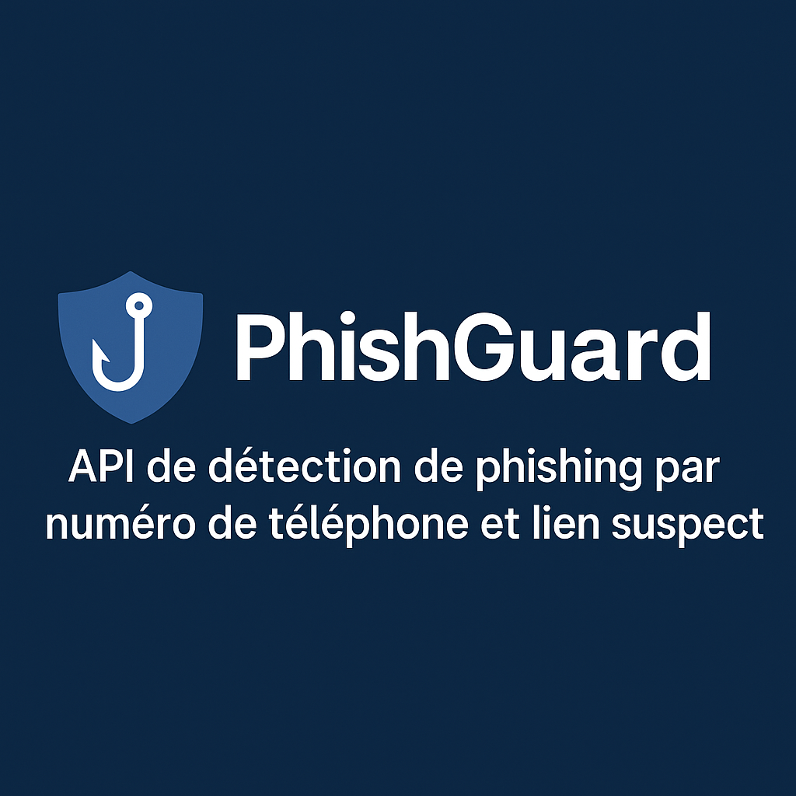
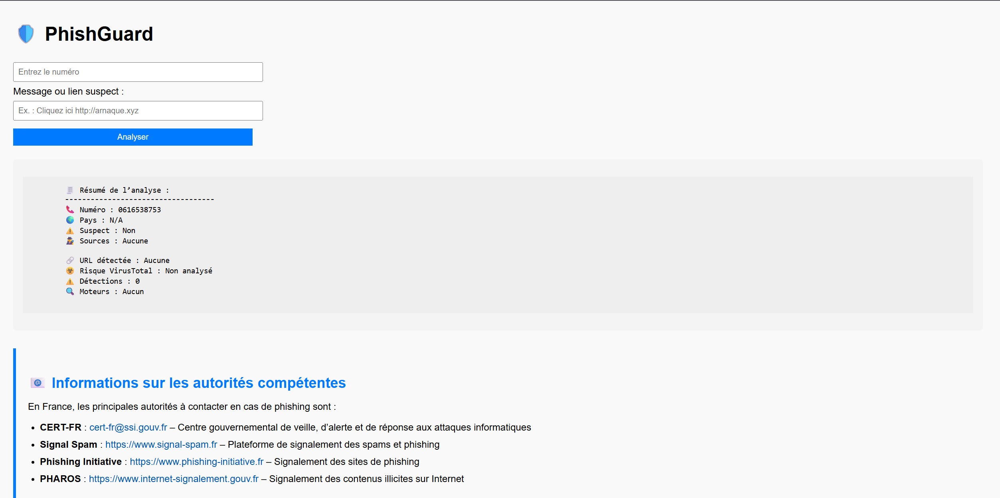

<p align="center">
  
</p>

# 🛡️ PhishGuard

**PhishGuard** est une API open source développée en Python (Flask) pour **détecter les tentatives de phishing par SMS**. Elle permet d’analyser un message reçu contenant un **numéro de téléphone** et où un **lien**, et fournit une interprétation lisible des risques détectés.

---

## 🚀 Fonctionnalités

🔍 **Analyse du numéro de téléphone** :
- Identification du pays, opérateur et format
- Détection de sources suspectes via PhoneInfoga
- Interprétation automatique du niveau de risque (fraude potentielle)

🕵️‍♂️ **Analyse du lien (URL)** :
- Extraction automatique depuis le message texte
- Vérification via l’API VirusTotal
- Évaluation du niveau de détection par moteurs antivirus

📬 **Interface web** :
- Formulaire simple pour entrer le numéro et le lien
- Affichage lisible des résultats
- Bouton d’alerte automatique vers le CERT-FR / ANSSI

---

## 🖥️ Interface Web

<p align="center">
  
</p>


- Le champ **"numéro"** attend un format international : `+33612345678`
- Le champ **"lien"** permet d’entrer une URL potentiellement frauduleuse
- Le bouton **"Analyser"** lance la requête vers l’API Flask
- Le bouton **"Alerter"** ouvre un email pré-rempli à destination des autorités

---

## 🔧 Technologies utilisées

| Langage/outil     | Usage principal                  |
|-------------------|----------------------------------|
| Python (Flask)     | Back-end API                    |
| JavaScript (Fetch) | Requête asynchrone à l’API     |
| HTML/CSS           | Interface utilisateur           |
| PhoneInfoga (.exe) | Analyse OSINT du numéro         |
| VirusTotal API     | Vérification des URL suspectes |

---

## 🛠️ Installation en local

```bash
git clone https://github.com/Corsican2Dev/phishguard.git
cd phishguard
python -m venv .venv
.venv\Scripts\activate
pip install -r requirements.txt
```

Place le binaire `phoneinfoga.exe` dans le dossier `tools/`.

Crée un fichier `.env` si besoin avec ta clé VirusTotal :
```
VT_API_KEY=ton_api_key
```

---

## ▶️ Lancer le projet

```bash
python app.py
```

Accès : [http://localhost:5000](http://localhost:5000)

---

## 📤 Déploiement GitHub

```bash
git add .
git commit -m "Mise à jour de l’API PhishGuard avec interface web + sécurité"
git push origin main
```

---

## 📩 Contacter les autorités (CERT-FR / ANSSI)

Le bouton "Alerter" dans l’interface ouvre un email vers :

- 📧 **CERT-FR** : cert-fr.cossi@ssi.gouv.fr
- 📧 **Signal Spam** : contact@signal-spam.fr

---

## 📄 Licence

Ce projet est distribué sous licence **GNU GPL v3**.

---

## 🤝 Contributeurs

- [Corsican2Dev](https://github.com/Corsican2Dev)

---

